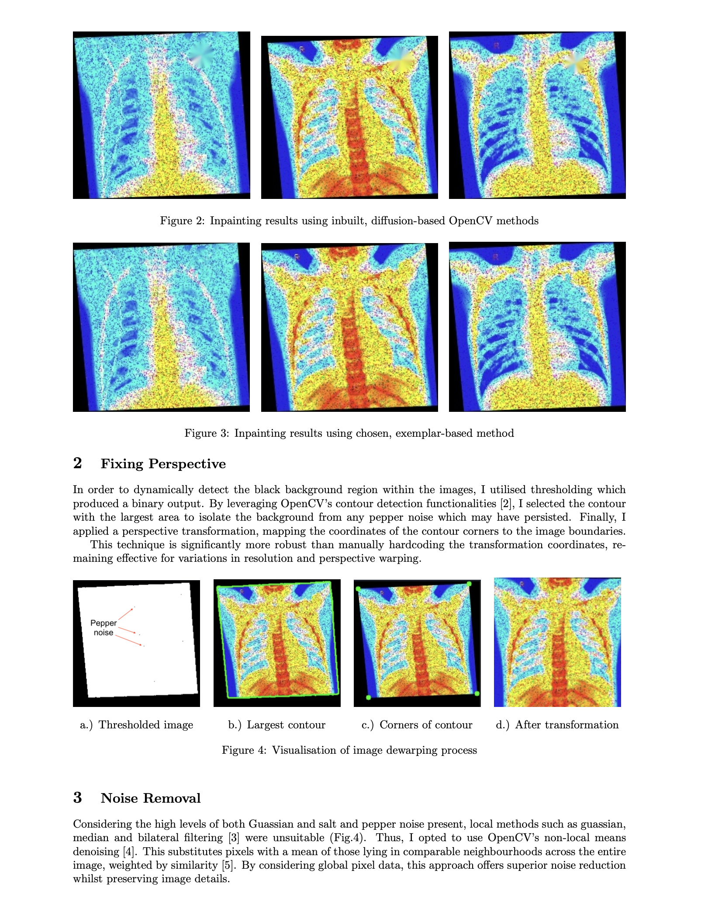

# Pneumonia X-Ray Image Processing

Performs image processing using Python's cv2 module on a series of x-ray images of lungs - some of which are suffering from pneumonia. The images have high levels of salt and pepper noise, perspective warping, colour imbalance, and a missing region. An example of one such image is given below.

[]

The program first applies inpainting to the missing region, then fixes the perspective using contours, applies non-local means denoising and gamma correction. Notably, a state-of-the-art, exemplar based inpainting algorithm is implemented from Criminisi *et al.* (2004). Here is the image after processing.

[]

 

## Usage

To run the program: `python main.py xray_images`. This will take approximately 7.5 mins to process the 100 images. The results are saved in `./Results`.

## Report

